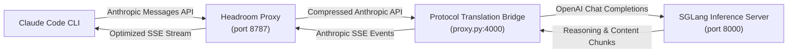
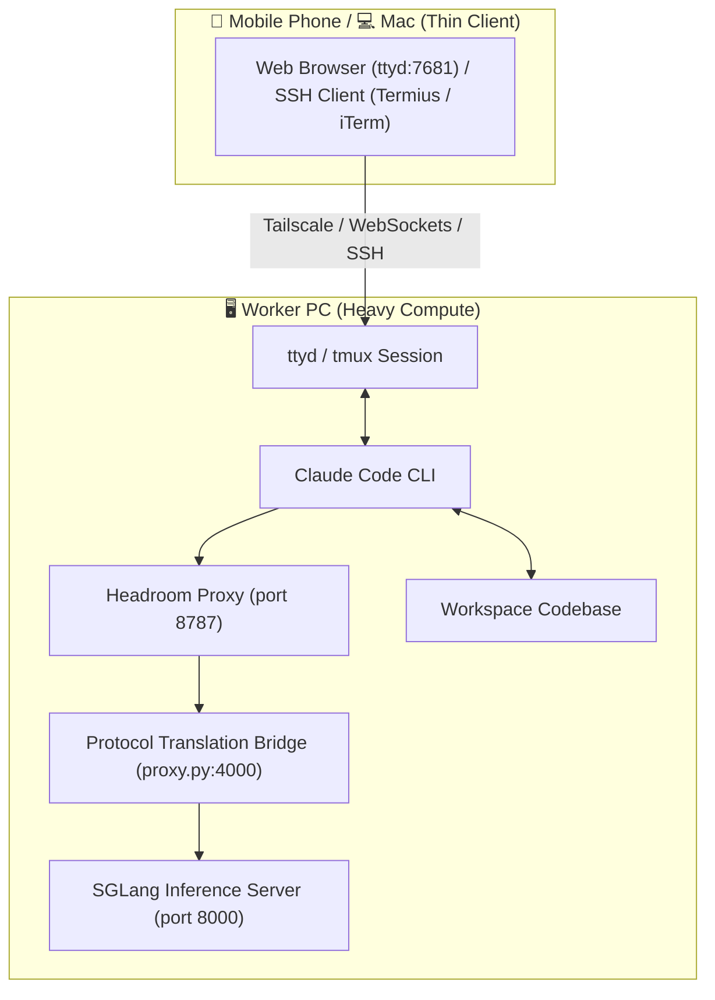

# Local & Remote SGLang Integration for Claude Code with Headroom AI

A high-performance integration for **Claude Code CLI** powered by the **Headroom AI** context optimization proxy (`headroom-ai`) and connected to an **SGLang** (or OpenAI-compatible) LLM server.

Supports both single-machine local execution and **Remote Worker & Thin-Client Architecture** (run heavy compute and LLM inference on a Worker PC and control seamlessly from a **Mac or Mobile Phone** via `ttyd` / `tmux` over Tailscale).

---

## Architecture Overview

### Single Machine / Local Architecture



### Remote Worker & Thin Client Architecture (Mobile & Mac)



### Component Roles

1. **Claude Code CLI**: The local developer CLI agent executing tools, reading code, and managing git tasks.
2. **Headroom Optimization Proxy (`headroom proxy`)**: Runs natively on port `8787`. Compresses prompt context (AST code structures, verbose JSON, repeated tool outputs), tracks cross-session memory, and handles live traffic learning (`--learn`).
3. **Protocol Translation Bridge (`proxy.py`)**: Runs on port `4000`. Translates Anthropic messages and tool calls into OpenAI Chat Completions format, extracts standard text and reasoning content (`reasoning_content` thinking tokens), and streams Anthropic SSE events back to Headroom.
4. **SGLang Inference Server**: Runs `Qwen/Qwen3.6-27B-FP8` (or any OpenAI-compatible LLM endpoint) on port `8000`.

---

## Key Capabilities & Features

- **Headroom Context Compression**: Intelligently compresses large tool outputs, code blocks, and conversation history using structural AST parsing (`ast-grep`) and `SmartCrusher`, cutting input prompt sizes by **20%–60%+** to accelerate GPU prefill speed.
- **Live Traffic Learning (`--learn`)**: Automatically learns error-recovery patterns, environment facts, and user preferences from proxy traffic and persists them to agent memory (`MEMORY.md`).
- **Vector & SQLite Cross-Session Memory (`--memory`)**: Maintains a persistent local context database, injecting relevant past memories into prompt context.
- **Reasoning Content Support (`reasoning_content`)**: Full support for streaming reasoning tokens emitted by reasoning models (Qwen 3.6, DeepSeek R1).
- **Mobile & Thin-Client Access**: Full support for remote mobile access via browser web terminals (`ttyd`) or mobile SSH apps (Termius, Blink Shell) over Tailscale.
- **Complete Protocol Support**: Native support for Anthropic streaming SSE, tool calls (`tool_use` and `tool_result`), multimodal base64 images, and non-streaming requests.
- **Config Isolation**: Uses an isolated configuration directory (`/tmp/claude_local`), bypassing Anthropic OAuth browser logins while preserving your real `~/.claude.json` untouched.

---

## Prerequisites & Environment Setup

Before running this project, ensure you have the following prerequisites installed on your system or Worker PC.

### 1. Install Node.js 18+ & Configure User-Level `npm` (No `sudo` Required)

To avoid `EACCES` permission errors when installing global npm packages on Linux:

```bash
# 1. Create a user-owned directory for npm global packages
mkdir -p ~/.npm-global
npm config set prefix '~/.npm-global'

# 2. Add the user npm bin directory to your PATH
echo 'export PATH="$HOME/.npm-global/bin:$PATH"' >> ~/.bashrc
source ~/.bashrc
```

### 2. Install Claude Code CLI

```bash
npm install -g @anthropic-ai/claude-code
```

Verify installation:
```bash
which claude
# Output: /home/user/.npm-global/bin/claude

claude --version
```

### 3. Install Remote Terminal Tools (For Remote Worker setup)

```bash
# macOS
brew install ttyd tmux

# Ubuntu / Debian
sudo apt update && sudo apt install -y ttyd tmux
```

---

## Installation & Configuration

### 1. Clone Repository & Install Python Dependencies

```bash
git clone https://github.com/hyw208/claude-code-local-llm.git
cd claude-code-local-llm

# Initialize Python Virtual Environment
python3 -m venv .venv
source .venv/bin/activate
pip install -r requirements.txt
```

### 2. Configure Environment Variables (`.env`)

Copy `.env.example` to `.env` and set your target SGLang / OpenAI-compatible endpoint URL:

```bash
cp .env.example .env
```

Default `.env` contents:
```env
# Target SGLang / OpenAI-compatible endpoint URL
SGLANG_URL=http://127.0.0.1:8000/v1/chat/completions

# SGLang Model Identifier
MODEL_NAME=Qwen/Qwen3.6-27B-FP8

# Local Proxy Ports
PROXY_PORT=4000
HEADROOM_PORT=8787
```

---

## Quick Start (Single Command)

Start the wrapper script from anywhere. It automatically launches the Headroom proxy in the background, configures environment isolation, and launches Claude Code CLI:

```bash
./start.sh
```

### Specifying a Target Workspace Folder

You can run `start.sh` from any location or pass a target directory path:

```bash
# Option 1: Pass target directory path directly
./start.sh /path/to/my-project

# Option 2: Run start.sh from inside your target directory
cd /path/to/my-project
/path/to/claude-code-local-llm/start.sh

# Option 3: Use explicit -C / --cd flag
./start.sh -C /path/to/my-project
```

### Automated Execution Flag (`--dangerously-skip-permissions`)

```bash
./start.sh /path/to/my-project --dangerously-skip-permissions
```
* **Without flag (`./start.sh`)**: Claude Code prompts for manual `[y/n]` approval before every file edit or shell command.
* **With flag (`./start.sh --dangerously-skip-permissions`)**: Bypasses interactive prompts for automated execution.

---

## Remote Worker & Thin Client Guide (Mobile & Mac)

Run heavy compute (SGLang + Claude Code) on your **Worker PC** and control it from your **Mac or Mobile phone**.

### Step 1: Set Up Worker PC Environment

```bash
# 1. Install prerequisites on Worker PC
sudo apt update && sudo apt install -y ttyd tmux nodejs npm
mkdir -p ~/.npm-global
npm config set prefix '~/.npm-global'
echo 'export PATH="$HOME/.npm-global/bin:$PATH"' >> ~/.bashrc
source ~/.bashrc

# 2. Install Claude Code CLI
npm install -g @anthropic-ai/claude-code

# 3. Clone repo & setup virtual environment
git clone https://github.com/hyw208/claude-code-local-llm.git
cd claude-code-local-llm
cp .env.example .env
python3 -m venv .venv
source .venv/bin/activate
pip install -r requirements.txt
```

### Step 2: Launch Persistent Web Session on Worker PC

Run `ttyd` with `-W` (`--writable`) attached to a background `tmux` session:

```bash
# 1. Create persistent background tmux session
tmux new-session -d -s claude "./start.sh /path/to/my-project --dangerously-skip-permissions; exec bash" 2>/dev/null || true

# 2. Serve the tmux session over web terminal on port 7681
ttyd -W -p 7681 tmux attach-session -t claude
```

### Step 3: Connect from Mac or Mobile Phone

* **Mac Browser**: Open `http://<worker-pc-ip>:7681` in Chrome or Safari.
* **Mac Terminal (SSH)**: Run `ssh user@<worker-pc-ip> -t "tmux a -t claude"`.
* **Mobile Phone (iOS / Android)**:
  - **Browser Web App**: Open `http://<worker-pc-ip>:7681` in mobile Safari/Chrome. Tap **"Add to Home Screen"** to turn it into a full-screen mobile app!
  - **Mobile SSH**: Use [Termius](https://termius.com/) or [Blink Shell](https://blink.sh/) connected over Tailscale.

---

## Stopping Sessions & Proxy Processes

### Stopping Local Sessions
```bash
./stop.sh
```

### Stopping Remote Worker Sessions
To cleanly shut down `ttyd`, the `tmux` session, and proxy processes on your Worker PC:

```bash
# User-scoped stop command
pkill -u $USER ttyd 2>/dev/null || sudo pkill ttyd
tmux kill-session -t claude 2>/dev/null || true
./stop.sh
```

---

## Troubleshooting Guide

| Issue / Error Message | Cause | Solution |
| :--- | :--- | :--- |
| `Error: 'claude' not found in PATH` | Claude Code CLI is not installed or `~/.npm-global/bin` is missing from `PATH` | Run `npm install -g @anthropic-ai/claude-code` and `export PATH="$HOME/.npm-global/bin:$PATH"`. |
| `pkill: killing pid failed: Operation not permitted` | Process belongs to another user/session | Use `pkill -u $USER ttyd` or `sudo pkill ttyd`. |
| `ERROR on binding fd to port 7681 (-1 98)` | Port 7681 is already in use by an old `ttyd` process | Kill old instance (`pkill -u $USER ttyd`) or pass `-p 7682`. |
| `The --writable option is not set` | `ttyd` launched in default read-only mode | Add `-W` flag: `ttyd -W -p 7681 ...`. |
| `ttyd infinite reconnect loop` | `ttyd` command exited immediately when launched | Use the 2-step setup: create background session `tmux new-session -d -s claude "..."` then run `ttyd -W -p 7681 tmux attach-session -t claude`. |
| `Invalid API key · Fix external API key` | Proxy target pointing at Headroom port instead of SGLang | Set `SGLANG_URL=http://<sglang-host>:8000/v1/chat/completions` in `.env`. |

---

## License

MIT License. Free for open-source and commercial use.
