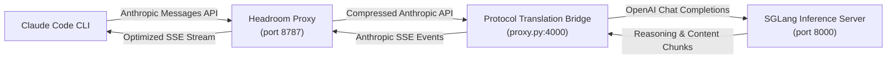
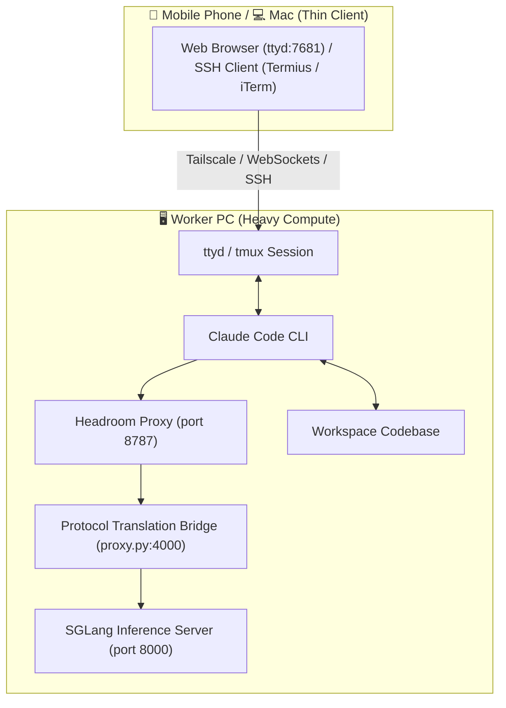

# Local & Remote SGLang Integration for Claude Code with Headroom AI

A high-performance integration for **Claude Code CLI** powered by the **Headroom AI** context optimization proxy (`headroom-ai`) and connected to an **SGLang** (or OpenAI-compatible) LLM server.

Supports both single-machine local execution and **Remote Worker & Thin-Client Architecture** (run heavy compute and LLM inference on a Worker PC and control seamlessly from a **Mac or Mobile Phone** via `ttyd` / `tmux` over Tailscale).

---
## Architecture Overview



### Component Roles

1. **Claude Code CLI**: The local developer CLI agent executing tools, reading code, and managing git tasks.
2. **Headroom Optimization Proxy (`headroom proxy`)**: Runs natively on port `8787`. Compresses prompt context (AST code structures, verbose JSON, repeated tool outputs), tracks cross-session memory, and handles live traffic learning (`--learn`).
3. **Protocol Translation Bridge (`proxy.py`)**: Runs on port `4000`. Translates Anthropic messages and tool calls into OpenAI Chat Completions format, extracts both standard text content and reasoning content (`reasoning_content` thinking tokens), and streams Anthropic SSE events back to Headroom.
4. **SGLang Inference Server**: Runs `Qwen/Qwen3.6-27B-FP8` (or any OpenAI-compatible LLM endpoint) on port `8000`.

---

## Key Capabilities & Features

- **Headroom Context Compression**: Intelligently compresses large tool outputs, code blocks, and conversation history using structural AST parsing (`ast-grep`) and `SmartCrusher`, cutting input prompt sizes by **20%–60%+** to accelerate GPU prefill speed.
- **Live Traffic Learning (`--learn`)**: Automatically learns error-recovery patterns, environment facts, and user preferences from proxy traffic and persists them to agent memory (`MEMORY.md`).
- **Vector & SQLite Cross-Session Memory (`--memory`)**: Maintains a persistent local context database, injecting relevant past memories into prompt context.
- **Reasoning Content Support (`reasoning_content`)**: Full support for streaming reasoning tokens emitted by reasoning models (Qwen 3.6, DeepSeek R1).
- **Mobile & Thin-Client Access**: Full support for remote mobile access via browser web terminals (`ttyd`) or mobile SSH apps (Termius, Blink Shell) over Tailscale.
- **Complete Protocol Support**: Native support for Anthropic streaming SSE, tool calls (`tool_use` and `tool_result`), multimodal base64 images, and non-streaming requests.
- **Config Isolation**: Uses an isolated configuration directory (`/tmp/claude_local`), bypassing Anthropic OAuth browser logins while preserving your real `~/.claude.json` untouched.

## Prerequisites

Before setting up, ensure you have the following installed on your machine (or Worker PC):

* **Node.js 18+ & npm**: Required to run Claude Code CLI.
* **Python 3.10+**: Required for `proxy.py` and `headroom-ai`.
* **Claude Code CLI**: Installed globally via `npm`:
  ```bash
  npm install -g @anthropic-ai/claude-code
  ```
* **SGLang / OpenAI-compatible LLM Server**: Running locally or accessible over network/Tailscale.

---

## Installation & Setup

### 1. Clone Repository
```bash
git clone https://github.com/hyw208/claude-code-local-llm.git
cd claude-code-local-llm
```

### 2. Install Claude Code CLI
```bash
npm install -g @anthropic-ai/claude-code
```

### 3. Create Virtual Environment & Install Dependencies
```bash
python3 -m venv .venv
source .venv/bin/activate
pip install -r requirements.txt
```

### 4. Configure Environment Variables
Copy `.env.example` to `.env` and set your target SGLang / OpenAI-compatible server URL:
```bash
cp .env.example .env
```
*(Optionally edit `.env` to set custom `SGLANG_URL`, `MODEL_NAME`, or proxy ports)*

---

## Quick Start (Single Command)

Start the wrapper script from anywhere. It automatically launches the Headroom proxy in the background, configures environment isolation, and launches Claude Code CLI:

```bash
./start.sh
```

### Specifying a Target Workspace Folder

You can run `start.sh` from any location or pass a target directory path:

```bash
# Option 1: Pass target directory path directly
./start.sh /path/to/my-project

# Option 2: Run start.sh from inside your target directory
cd /path/to/my-project
/path/to/claude-code-local-llm/start.sh

# Option 3: Use explicit -C / --cd flag
./start.sh -C /path/to/my-project
```

### Automated Execution Flag (`--dangerously-skip-permissions`)

```bash
./start.sh /path/to/my-project --dangerously-skip-permissions
```
* **Without flag (`./start.sh`)**: Claude Code prompts for manual `[y/n]` approval before every file edit or shell command.
* **With flag (`./start.sh --dangerously-skip-permissions`)**: Bypasses interactive prompts for automated execution.

---

## Usage Reference

### Command Syntax

```bash
./start.sh [DIRECTORY] [OPTIONS...]
./start.sh -C <directory> [OPTIONS...]
```

### Script Arguments & Options

| Option / Argument | Description |
| :--- | :--- |
| `DIRECTORY` | Path to target workspace directory for Claude Code to open in |
| `-C, --cd <dir>` | Set target workspace directory |
| `--dangerously-skip-permissions` | Bypass manual approval prompts for edits and shell commands |
| `-p, --print [prompt]` | Run in non-interactive print mode |
| `-c, --continue` | Continue the most recent conversation session |
| `-r, --resume [id]` | Resume a specific session |
| `-h, --help` | Show script usage summary and Claude Code options |

### Stopping the Proxy

To stop the background Headroom proxy process at any time:
```bash
./stop.sh
```

### Monitoring Logs & Savings

View live incoming prompts, Headroom compression stats, and model responses:
```bash
tail -f /tmp/proxy.log
```

---

## Headroom CLI Utilities

Because Headroom is installed in your `.venv`, you can use Headroom's native CLI suite to inspect savings and memory:

```bash
# View durable token savings & compression metrics over time
.venv/bin/headroom savings

# Inspect original vs. compressed content for recent proxy requests
.venv/bin/headroom inspect

# Open the Headroom savings dashboard in your browser
.venv/bin/headroom dashboard

# Check proxy routing and dependencies health
.venv/bin/headroom doctor

# Manage stored cross-session memories
.venv/bin/headroom memory list
```

---

## Remote Worker & Thin Client Architecture (Mobile & Mac)

You can run Claude Code, Headroom, and SGLang on a powerful **Worker PC** (heavy compute) and interact with it from your **Mac or Mobile phone** as a lightweight thin client.

### Remote Architecture Flow



### Step-by-Step Remote Setup & Run Guide

#### Step 1: Install Prerequisites on Worker PC
Ensure Node.js, `npm`, `@anthropic-ai/claude-code`, `ttyd`, and `tmux` are installed on your Worker PC:
```bash
# macOS
brew install ttyd tmux node
npm install -g @anthropic-ai/claude-code

# Ubuntu / Debian
sudo apt update && sudo apt install -y ttyd tmux nodejs npm
sudo npm install -g @anthropic-ai/claude-code
```

#### Step 2: Set Up Workspace & Dependencies on Worker PC
Clone this repo to your Worker PC, configure `.env`, and initialize the Python virtual environment:
```bash
git clone https://github.com/hyw208/claude-code-local-llm.git
cd claude-code-local-llm

# Initialize environment
cp .env.example .env
python3 -m venv .venv
source .venv/bin/activate
pip install -r requirements.txt
```

#### Step 3: Launch Headroom Proxy & Session on Worker PC
Create a persistent detached `tmux` session, then run `ttyd` with `-W` (`--writable`) attached to it:

```bash
# 1. Create persistent background tmux session running start.sh
tmux new-session -d -s claude "./start.sh /path/to/my-project --dangerously-skip-permissions; exec bash" 2>/dev/null || true

# 2. Serve the tmux session over web terminal on port 7681
ttyd -W -p 7681 tmux attach-session -t claude
```

> [!NOTE]
> **Why this 2-step setup is solid**:
> Separating session creation from `ttyd` ensures that browser refreshes or disconnects never kill your Claude Code session. If `start.sh` exits, `; exec bash` keeps the tmux window open so `ttyd` doesn't enter an infinite reconnect loop.

> [!NOTE]
> **Troubleshooting `ERROR on binding fd to port 7681`**:
> If port `7681` is already in use by another process, kill the existing instance (`pkill ttyd`) or pick an alternate port like `-p 7682`:
> ```bash
> ttyd -W -p 7682 tmux attach-session -t claude
> ```

#### Step 4: Connect from Mac or Mobile Phone

##### 💻 Mac Access Options
* **Mac Browser (Web UI)**: Open `http://<worker-pc-ip>:7681` in Chrome or Safari.
* **Mac Terminal (SSH)**: Run `ssh user@<worker-pc-ip> -t "tmux a -t claude"` for native terminal keybindings.

##### 📱 Mobile Access Options (iOS & Android)
Your mobile phone acts as a lightweight remote control UI displaying real-time streaming tokens and accepting user prompts, while your Worker PC executes all code and SGLang GPU inference.

* **Option A: Web App (No SSH App Needed)**:
  Open `http://<worker-pc-ip>:7681` in Safari or Chrome on your phone. Tap **"Add to Home Screen"** to turn it into a full-screen mobile app!
* **Option B: Mobile SSH App**:
  Use [Termius](https://termius.com/) (iOS/Android) or [Blink Shell](https://blink.sh/) (iOS) over Tailscale:
  ```bash
  ssh user@<worker-pc-ip> -t "tmux a -t claude"
  ```

### Stopping the Remote Session on Worker PC

To cleanly stop `ttyd`, terminate the background `tmux` session, and shut down proxy processes:

```bash
# 1. Stop the web terminal server (ttyd)
pkill ttyd

# 2. Terminate the background tmux session
tmux kill-session -t claude

# 3. Stop background proxy processes
./stop.sh
```

*(Or run all 3 in a single command: `pkill ttyd; tmux kill-session -t claude 2>/dev/null; ./stop.sh`)*

### Key Advantages
* 🔋 **Zero Mac/Mobile Battery Drain**: All file processing and LLM inference happens on the Worker PC.
* ⚡ **Ultra-Low Latency**: `proxy.py` and `SGLang` communicate over local `127.0.0.1` inside the Worker PC.
* 🔄 **100% Session Persistence**: Closing your laptop lid or phone browser tab never kills Claude Code—reconnect anytime to pick up right where it left off.

---

## Configuration & Isolation Details

### 1. Environment Configuration (`.env`)
Copy `.env.example` to `.env` to customize your target server and port settings:

```bash
cp .env.example .env
```

| Environment Variable | Description | Default |
| :--- | :--- | :--- |
| `SGLANG_URL` | Target SGLang / OpenAI-compatible endpoint URL | `http://127.0.0.1:8000/v1/chat/completions` |
| `MODEL_NAME` | Model ID string sent in completions request | `Qwen/Qwen3.6-27B-FP8` |
| `PROXY_PORT` | Local FastAPI translation proxy port | `4000` |
| `HEADROOM_PORT` | Headroom optimization proxy port | `8787` |

### 2. Dual Config Setup (`~/.claude.json`)
* **When running `./start.sh`**: Uses `CLAUDE_CONFIG_DIR="/tmp/claude_local"`. Claude Code completely **ignores** your home `~/.claude.json` and uses `/tmp/claude_local/.claude.json`.
* **When running standard `claude`**: Uses your real `~/.claude.json` so you can switch back to Anthropic cloud anytime.

---

## Switching Back to Anthropic Cloud

To return to standard Claude Code with Anthropic's cloud:
```bash
# Run standard claude in a clean terminal (uses your real ~/.claude.json)
claude
```
